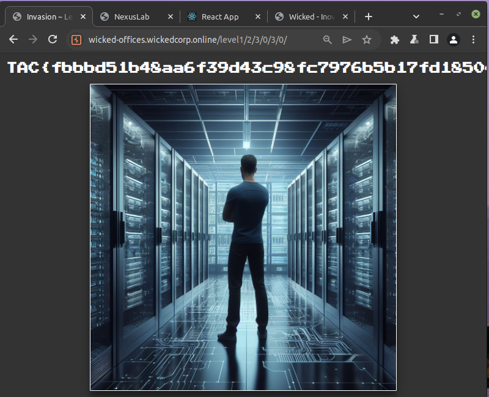

# Write Ups ~ Wicked Offices

## Office nº 0

Ao acessar a URL do desafio, [https://wicked-offices.wickedcorp.online/level0/](https://wicked-offices.wickedcorp.online/level0/) o jogador irá se deparar com uma imagem de um corredor que possui 4 *links* clicáveis, dando as seguintes opções para o usuário:

- *link superior esquerdo:* path `/level0/0/`;
- *link superior direito:* path `/level0/1/`;
- *link inferior esquerdo:* path `/level0/2/`;
- *link inferior direito:* path `/level0/3/`.


A tela seguinte apresenta o mesmo corredor, dando as mesmas 4 opções novamente para o usuário. Porém, desta vez a próxima irá levar
o usuário para um caminho sem *links*, indicando que chegou à um beco sem saída e deve retornar.


Logo, para encontrar a *flag*, o usuário deve percorrer manualmente as 20 (4^1 + 4^2) variações de URL buscando encontrar o *path* que a flag se encontra (que no desafio será o path `/level0/2/3`):


- **Flag:** `TAC{cbfa41bfc7a02097a787b210fe612fd3ee4b93e84e7c1ace07dd8391f73ac6e8}`

## Office nº 1

Similar ao desafio anterior, porém desta vez o usuário terá 1364 (4 + 4^2 + 4^3 + 4^4 + 4^5) variações de *paths* que precisa
explorar para encontrar a *flag*. Dito isso, o usuário deverá utilizar alguma ferramenta de automação, como um script Python automatizado ou um FFUF, para poder navegar rapidamente pelas opções e obter a *flag*.

O script a seguir ilustra um exemplo de código que poderia ser utilizado para obter a flag:

```python
# @TODO script
```

Por fim, o usuário conseguiria obter a flag no path `/level1/2/3/0/3/0/`



- **Flag:** `TAC{fbbbd51b48aa6f39d43c98fc7976b5b17fd185042bf0c1b5e5e1642236d90d34}`

## Office nº 2

Neste desafio os corredores apresentam apenas 4 níveis de profundidade, possuindo apenas 340 (4 + 4^2 + 4^3 + 4^4) opções de URL para o usuário percorrer. No entanto, diferente das opções numéricas [0, 1, 2, 3] utilizadas no desafio anterior, neste cada corredor possui *links* com strings aleatórias que variam a cada iteração. A imagem a seguir ilustra tal comportamento:


Logo, o *script* anterior terá que ser modificado para navegar e extrair, página por página, as opções de *links* até encontrar a combinação em que a flag se encontra.

```python
# @TODO script
```

Por fim, o usuário conseguiria obter a flag no path `/level2/coos/dale/deed/move/`


- **Flag:** `TAC{ea48266a725636fea755acdbcbb921d65abe03c0a18d62b8eb3670cf23663f9d}`

## Office nº 3

Neste desafio, ao clicar em algum dos *links* o usuário será capaz de repara que foram introduzidos dois parâmetros na URL, vide o exemplo a seguir:

- `https://wicked-offices.wickedcorp.online/level3/wish/?code=2526&hash=0000ddd9caf8042bbdcc85bdb2860f6923797f324be18eaf13570c690047c3a0`


Ao tentar acessar a URL sem a presença algum dos parâmetros, ou tentar modificá-los, é possível notar que uma tela de alerta é exibida para o jogador:


Ao análisar o código HTML da página, é possível constatar que neste desafio foi adicionar um arquivo *JavaScript* que possui uma função que é executada sempre que um dos *links* da imagem é pressionado:

```javascript
// Link do arquivo: https://wicked-offices.wickedcorp.online/proof-of-work.js
async function clickCallback(nextPath){
    // Change the title to the bypassing text
    document.getElementById('titleMessage').innerText = "Bypassing..."
    
    // Generate Nonce
    const nonce = document.location.pathname.split('/').join('') + nextPath

    // Calculate proof of work
    for(let i = 0; ; i++){
        const msgUint8 = new TextEncoder().encode(`${i}${nonce}`);
        const hashBuffer = await crypto.subtle.digest("SHA-256", msgUint8);
        const hashArray = Array.from(new Uint8Array(hashBuffer));
        const hashHex = hashArray
            .map((b) => b.toString(16).padStart(2, "0"))
            .join("");

        if(hashHex.startsWith("0000"))
            window.location = `${document.location.origin}${document.location.pathname}${nextPath}/?code=${i}&hash=${hashHex}`;    
    }
}
```

Realizando a análise do código, é possível constatar que se trata de um algoritmo de **Prova de Trabalho** (*Proof of Work*), tais algoritmos podem ser utilizados como métodos para tornar ataques automatizados mais custosos, ao obrigar o usuário a resolver um desafio matemático para poder autenticar sua requisição.

Logo, precisamos modificar o *script* utilizado no desafio anterior para conseguir calcular e adicionar os dois novos parâmetros e, com isso, obter a flag:

```python
# @TODO script
```

Por fim, o usuário conseguiria obter a flag no path `/level3/fans/dope/pair/boat/?code=11173&hash=00002d99fb3a07ccda026a322e7a3d3803c2e3522c9cdbb6afa1be3fb1396a55`.


- **Flag:** `TAC{6ca79670b2dfe2e2059ccbbece565676c53ece8b46b2cfca46fdc3361c906fbd}`